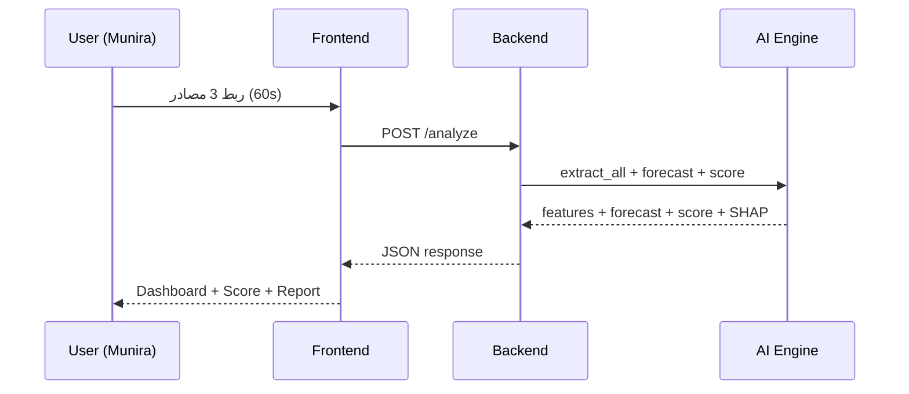

# JAHIZ Architecture

> **محرك الجاهزية التمويلية الفوري للمنشآت الصغيرة والمتوسطة**
> Instant SME Financing Readiness Engine

---

## 📑 الفهرس

1. [نظرة عامة](#1-نظرة-عامة)
2. [المعمارية العامة](#2-المعمارية-العامة)
3. [مصادر البيانات](#3-مصادر-البيانات)
4. [محرك الذكاء الاصطناعي](#4-محرك-الذكاء-الاصطناعي)
5. [تدفق البيانات](#5-تدفق-البيانات)
6. [المكدس التقني](#6-المكدس-التقني)
7. [الأمان والامتثال](#7-الأمان-والامتثال)
8. [قابلية التوسع](#8-قابلية-التوسع)
9. [النشر والتشغيل](#9-النشر-والتشغيل)
10. [خارطة الطريق](#10-خارطة-الطريق)

---

## 1. نظرة عامة

**JAHIZ** منصة ذكاء اصطناعي تربط 3 مصادر بيانات مالية ومنشآت في **60 ثانية**، لتمنح:

| المخرج | الوصف | المستفيد |
|:---|:---|:---|
| 🎯 **JAHIZ-Ready Score** | سكور من 0 إلى 1000 مع تفسير SHAP | البنك + المنشأة |
| 🔔 **Liquidity Alert** | تنبؤ بفجوة سيولة قبل 45 يوماً | المنشأة |
| 📄 **Smart Bank Report** | تقرير ائتماني ذكي جاهز للقرار | البنك |

### المشكلة التي يحلها

- **78%** من طلبات تمويل المنشآت الصغيرة والمتوسطة في السعودية تُرفض.
- السبب: البنك لا يستطيع "رؤية" المنشأة بدون قوائم مالية مدققة.
- النتيجة: **5 مليار ريال** في محفظة البنك السعودي للاستثمار تبقى نائمة.
- منشآت حقيقية مثل "منيرة - صاحبة كافيه" تُغلق فروعها بسبب فجوات سيولة لم تكن متوقعة.

### الحل

بناء **لغة مالية مشتركة** بين المنشأة والبنك، مستخرجة من بيانات موجودة فعلاً:
- 🧾 الفاتورة الإلكترونية (ZATCA)
- 💳 معاملات مدى / نقاط البيع
- 🏦 الحساب البنكي عبر المصرفية المفتوحة

---

## 2. المعمارية العامة

JAHIZ مبني على معمارية **3-tier** مع فصل صريح بين الواجهة، الخلفية، ومحرك الذكاء الاصطناعي.

```
┌─────────────────────────────────────────────────────────────────┐
│                    PRESENTATION LAYER                            │
│   Onboarding + Dashboard + Bank Report                          │
│   Next.js 14 + Tailwind                                          │
└─────────────────────────────────────────────────────────────────┘
                              │  REST / JSON
                              ▼
┌─────────────────────────────────────────────────────────────────┐
│                    APPLICATION LAYER                             │
│   FastAPI + Feature Engineer + Forecast + Score + Report        │
└─────────────────────────────────────────────────────────────────┘
                              │
                              ▼
┌─────────────────────────────────────────────────────────────────┐
│                     DATA & AI LAYER                              │
│   PostgreSQL + Redis + Celery + Prophet + XGBoost + AraBERT     │
└─────────────────────────────────────────────────────────────────┘
                              │
                              ▼
┌─────────────────────────────────────────────────────────────────┐
│                    EXTERNAL INTEGRATIONS                         │
│   ZATCA e-Invoicing + Mada/POS + Open Banking (Lean)            │
└─────────────────────────────────────────────────────────────────┘
```

---

## 3. مصادر البيانات

### 3.1 ZATCA e-Invoicing

| البُعد | التفاصيل |
|:---|:---|
| **طريقة الربط** | REST API + OAuth 2.0 |
| **البيانات المستخرجة** | فواتير، مشتريات، ضريبة، تركز العملاء |
| **التحديث** | Real-time / Daily batch |
| **الاستخدام** | الإيراد الحقيقي، مؤشر HHI، الموسمية |

**الميزات المستخرجة:** `customer_hhi`, `invoice_value_trend`, `monthly_revenue_avg`

### 3.2 Mada / POS

| البُعد | التفاصيل |
|:---|:---|
| **طريقة الربط** | API من مزود نقاط البيع |
| **البيانات المستخرجة** | معاملات يومية، توزيع زمني |
| **التحديث** | Real-time |
| **الاستخدام** | التدفق اليومي، سلوك الدفع |

### 3.3 Open Banking (Lean Technologies)

| البُعد | التفاصيل |
|:---|:---|
| **طريقة الربط** | Lean SDK + OAuth 2.0 + PKCE |
| **البيانات المستخرجة** | رصيد، تحويلات، مصاريف، رواتب، إيجار |
| **التحديث** | Daily / On-demand |
| **الاستخدام** | المصاريف، الرواتب، الموردين، DSO |

**الميزات المستخرجة:** `cashflow_volatility`, `fixed_cost_ratio`, `supplier_delay_days`, `dso_days`

---

## 4. محرك الذكاء الاصطناعي

### 4.1 تصنيف الفواتير (AraBERT + Rules)

| المقياس | القيمة |
|:---|:---:|
| **البيانات التدريبية** | 12,000 فاتورة |
| **الدقة** | 92% |
| **زمن الاستدلال** | < 50ms / فاتورة |

### 4.2 التنبؤ بالسيولة (Prophet + LSTM)

| المقياس | القيمة |
|:---|:---:|
| **نافذة التنبؤ** | 45 يوماً |
| **MAPE** | < 12% |
| **الموسمية المدمجة** | رواتب، إيجار، رمضان |
| **التحذير المبكر** | 45 يوماً قبل الفجوة |

### 4.3 السكور الائتماني (XGBoost + SHAP)

| الميزة | الوزن |
|:---|:---:|
| `customer_hhi` | -250 |
| `dso_days` | -3 / يوم |
| `cashflow_volatility` | -120 |
| `invoice_value_trend` | +200 |
| `seasonality_strength` | +30 |
| `fixed_cost_ratio` | -150 |
| `supplier_delay_days` | -2 / يوم |
| `monthly_revenue_avg` | +0.001 |

**الفئات:**

| السكور | الفئة | الحكم |
|:---:|:---|:---|
| 750-1000 | 🏆 بلاتيني | جاهز فوري |
| 600-749 | 🥇 ذهبي | جاهز مشروط |
| 450-599 | 🥈 فضي | يحتاج مراجعة |
| 0-449 | ⏳ قيد التأهيل | غير مؤهل |

### 4.4 تقرير البنك الذكي (GPT-4o mini)

بنية التقرير:
1. JAHIZ-Ready Score + الفئة + الحكم
2. الملخص التنفيذي
3. المحركات الرئيسية (SHAP)
4. تنبؤ السيولة 45 يوماً
5. التوصية النهائية
6. الشفافية والمصادر

---

## 5. تدفق البيانات



---

## 6. المكدس التقني

| الطبقة | التقنية |
|:---|:---|
| **Frontend** | Next.js 14 + React 18 + Tailwind + Recharts |
| **Backend** | Python 3.10+ + FastAPI 0.115 + Pydantic 2.9 |
| **AI/ML** | Prophet 1.1 + XGBoost 2.1 + SHAP 0.46 + AraBERT |
| **Data** | pandas 2.2 + numpy 1.26 + scikit-learn 1.5 |
| **DB** | PostgreSQL + Redis + Celery |
| **DevOps** | Docker + GitHub Actions + Vercel + Railway |

---

## 7. الأمان والامتثال

- **OAuth 2.0 + PKCE** لكل تكامل خارجي
- **JWT** (15 دقيقة) + **Refresh Token** (7 أيام)
- **TLS 1.3** في النقل + **AES-256** في التخزين
- **Zero-Retention**: لا نخزن البيانات المالية الأصلية
- **الامتثال:** ساما (طبقة تأهيل فقط) + ZATCA + PDPL

---

## 8. قابلية التوسع

| المقياس | السنة 1 | السنة 3 |
|:---|:---:|:---:|
| **المنشآت** | 10,000 | 250,000 |
| **التقارير/شهر** | 5,000 | 100,000 |
| **API Requests/day** | 50K | 2M |
| **SLA** | 99.5% | 99.9% |

---

## 9. النشر والتشغيل

| البيئة | Frontend | Backend |
|:---|:---|:---|
| **Development** | localhost:3000 | localhost:8000 |
| **Staging** | Vercel Preview | Railway Staging |
| **Production** | Vercel | Railway / Render |

**CI/CD:** GitHub Actions → Generate data → Test → Lint → Deploy

---

## 10. خارطة الطريق

- ✅ **المرحلة 1 (الهاكاثون):** MVP مع بيانات محاكاة
- ⏳ **المرحلة 2 (شهر 1-3):** تكامل ZATCA + Lean + Next.js Dashboard
- ⏳ **المرحلة 3 (شهر 4-6):** ترخيص ساما + Pilot 100 منشأة
- ⏳ **المرحلة 4 (شهر 7-12):** إطلاق تجاري + 10,000 منشأة
- ⏳ **المرحلة 5 (السنة 2):** التوسع الخليجي + 100,000 منشأة

---

<div align="center">

**JAHIZ | جاهز — تمكين المنشآت قبل أن تموت**

</div>
