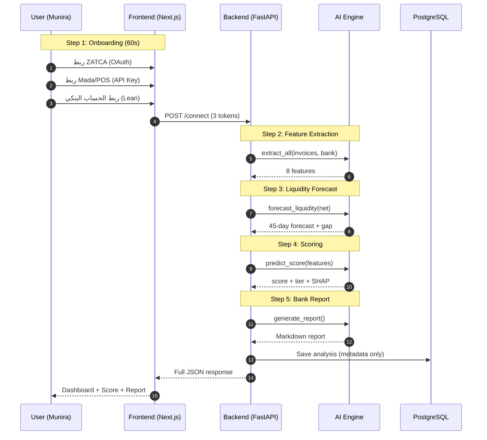

# JAHIZ Architecture

> **محرك الجاهزية التمويلية الفوري للمنشآت الصغيرة والمتوسطة**
> Instant SME Financing Readiness Engine

---

## 📑 الفهرس

1. [نظرة عامة](#1-نظرة-عامة)
2. [المعمارية العامة](#2-المعمارية-العامة)
3. [مصادر البيانات](#3-مصادر-البيانات)
4. [محرك الذكاء الاصطناعي](#4-محرك-الذكاء-الاصطناعي)
5. [تدفق البيانات](#5-تدفق-البيانات)
6. [المكدس التقني](#6-المكدس-التقني)
7. [الأمان والامتثال](#7-الأمان-والامتثال)
8. [قابلية التوسع](#8-قابلية-التوسع)
9. [النشر والتشغيل](#9-النشر-والتشغيل)
10. [خارطة الطريق](#10-خارطة-الطريق)

---

## 1. نظرة عامة

**JAHIZ** منصة ذكاء اصطناعي تربط 3 مصادر بيانات مالية ومنشآت في **60 ثانية**، لتمنح:

| المخرج | الوصف | المستفيد |
|:---|:---|:---|
| 🎯 **JAHIZ-Ready Score** | سكور من 0 إلى 1000 مع تفسير SHAP | البنك + المنشأة |
| 🔔 **Liquidity Alert** | تنبؤ بفجوة سيولة قبل 45 يوماً | المنشأة |
| 📄 **Smart Bank Report** | تقرير ائتماني ذكي جاهز للقرار | البنك |

### المشكلة التي يحلها

- **78%** من طلبات تمويل المنشآت الصغيرة والمتوسطة في السعودية تُرفض.
- السبب: البنك لا يستطيع "رؤية" المنشأة بدون قوائم مالية مدققة.
- النتيجة: **5 مليار ريال** في محفظة البنك السعودي للاستثمار تبقى نائمة.
- منشآت حقيقية مثل "منيرة - صاحبة كافيه" تُغلق فروعها بسبب فجوات سيولة لم تكن متوقعة.

### الحل

بناء **لغة مالية مشتركة** بين المنشأة والبنك، مستخرجة من بيانات موجودة فعلاً:
- 🧾 الفاتورة الإلكترونية (ZATCA)
- 💳 معاملات مدى / نقاط البيع
- 🏦 الحساب البنكي عبر المصرفية المفتوحة

---

## 2. المعمارية العامة

JAHIZ مبني على معمارية **3-tier** مع فصل صريح بين الواجهة، الخلفية، ومحرك الذكاء الاصطناعي.

```
┌─────────────────────────────────────────────────────────────────┐
│                    PRESENTATION LAYER                            │
│                                                                   │
│   ┌─────────────┐  ┌─────────────┐  ┌─────────────┐             │
│   │  Onboarding │  │  Dashboard  │  │ Bank Report │             │
│   │  (3-Step    │  │  (Score +   │  │  (Preview + │             │
│   │   Connect)  │  │   Forecast) │  │   Export)   │             │
│   └─────────────┘  └─────────────┘  └─────────────┘             │
│                     Next.js 14 + Tailwind                        │
└─────────────────────────────────────────────────────────────────┘
                              │  REST / JSON
                              ▼
┌─────────────────────────────────────────────────────────────────┐
│                    APPLICATION LAYER                             │
│                                                                   │
│   ┌─────────────────────────────────────────────────────────┐   │
│   │              FastAPI (REST API)                          │   │
│   │  POST /analyze    GET /forecast    GET /health           │   │
│   └─────────────────────────────────────────────────────────┘   │
│                                                                   │
│   ┌──────────┐  ┌──────────┐  ┌──────────┐  ┌──────────┐        │
│   │ Feature  │  │ Liquidity│  │  Score   │  │  Bank    │        │
│   │ Engineer │→ │ Forecast │→ │  Engine  │→ │  Report  │        │
│   └──────────┘  └──────────┘  └──────────┘  └──────────┘        │
└─────────────────────────────────────────────────────────────────┘
                              │
                              ▼
┌─────────────────────────────────────────────────────────────────┐
│                     DATA & AI LAYER                              │
│                                                                   │
│  ┌──────────────┐  ┌──────────────┐  ┌──────────────┐           │
│  │  PostgreSQL  │  │    Redis     │  │   Celery     │           │
│  │  (Metadata)  │  │   (Cache)    │  │  (Async)     │           │
│  └──────────────┘  └──────────────┘  └──────────────┘           │
│                                                                   │
│  ┌──────────────┐  ┌──────────────┐  ┌──────────────┐           │
│  │  Prophet +   │  │  XGBoost +   │  │  AraBERT +   │           │
│  │    LSTM      │  │    SHAP      │  │    Rules     │           │
│  └──────────────┘  └──────────────┘  └──────────────┘           │
└─────────────────────────────────────────────────────────────────┘
                              │
                              ▼
┌─────────────────────────────────────────────────────────────────┐
│                    EXTERNAL INTEGRATIONS                         │
│                                                                   │
│  ┌──────────────┐  ┌──────────────┐  ┌──────────────┐           │
│  │   ZATCA      │  │  Mada / POS  │  │  Open Banking│           │
│  │  e-Invoicing │  │   Provider   │  │    (Lean)    │           │
│  └──────────────┘  └──────────────┘  └──────────────┘           │
└─────────────────────────────────────────────────────────────────┘
```

---

## 3. مصادر البيانات

### 3.1 ZATCA e-Invoicing

| البُعد | التفاصيل |
|:---|:---|
| **طريقة الربط** | REST API + OAuth 2.0 |
| **البيانات المستخرجة** | فواتير، مشتريات، ضريبة، تركز العملاء |
| **التحديث** | Real-time / Daily batch |
| **الاستخدام** | الإيراد الحقيقي، مؤشر HHI، الموسمية |

**الميزات المستخرجة:**
- `customer_hhi` — تركيز العملاء
- `invoice_value_trend` — نمو قيمة الفاتورة
- `monthly_revenue_avg` — متوسط الإيراد الشهري

### 3.2 Mada / POS

| البُعد | التفاصيل |
|:---|:---|
| **طريقة الربط** | API من مزود نقاط البيع |
| **البيانات المستخرجة** | معاملات يومية، توزيع زمني |
| **التحديث** | Real-time |
| **الاستخدام** | التدفق اليومي، سلوك الدفع |

### 3.3 Open Banking (Lean Technologies)

| البُعد | التفاصيل |
|:---|:---|
| **طريقة الربط** | Lean SDK + OAuth 2.0 + PKCE |
| **البيانات المستخرجة** | رصيد، تحويلات، مصاريف، رواتب، إيجار |
| **التحديث** | Daily / On-demand |
| **الاستخدام** | المصاريف، الرواتب، الموردين، DSO |

**الميزات المستخرجة:**
- `cashflow_volatility` — تذبذب التدفق
- `fixed_cost_ratio` — نسبة المصاريف الثابتة
- `supplier_delay_days` — تأخر سداد الموردين
- `dso_days` — متوسط أيام التحصيل

---

## 4. محرك الذكاء الاصطناعي

### 4.1 تصنيف الفواتير والمصاريف

```
Input:  فاتورة عربية + معاملات بنكية
        ↓
Model:  AraBERT (Transformer عربي) + Rules
        ↓
Output: تصنيف تلقائي (رواتب، إيجار، موردين، ضريبة، تحصيلات)
```

| المقياس | القيمة |
|:---|:---:|
| **البيانات التدريبية** | 12,000 فاتورة |
| **الدقة** | 92% |
| **زمن الاستدلال** | < 50ms / فاتورة |

### 4.2 التنبؤ بالسيولة

```
Input:  daily net cashflow (180 يوماً)
        ↓
Model:  Prophet + LSTM (ensemble)
        ↓
Output: 45-day forecast + first gap detection
```

| المقياس | القيمة |
|:---|:---:|
| **نافذة التنبؤ** | 45 يوماً |
| **MAPE** | < 12% |
| **الموسمية المدمجة** | رواتب، إيجار، رمضان |
| **التحذير المبكر** | 45 يوماً قبل الفجوة |

**كيف يعمل Prophet؟**

```
1. تحليل الاتجاه (Trend)
2. فصل الموسمية الأسبوعية (Weekly)
3. دمج المناسبات السعودية (Holidays)
4. تقدير فترات الثقة (80%)
5. حساب الرصيد التراكمي
6. كشف أول يوم سلبي = فجوة سيولة
```

### 4.3 السكور الائتماني

```
Input:  8 features (من Feature Engineering)
        ↓
Model:  XGBoost Classifier (300 trees, depth 5)
        ↓
Output: probability_good → score 0-1000
        ↓
Explainer: SHAP TreeExplainer → Top 5 factors
```

**الميزات الثمانية وأوزانها:**

| الميزة | الوزن | التأثير |
|:---|:---:|:---:|
| `customer_hhi` | -250 | ⬇️ كلما زاد تركيز العملاء |
| `dso_days` | -3 / يوم | ⬇️ كلما طال التحصيل |
| `cashflow_volatility` | -120 | ⬇️ كلما زاد التذبذب |
| `invoice_value_trend` | +200 | ⬆️ نمو قيمة الفاتورة |
| `seasonality_strength` | +30 | ⬆️ موسمية معتدلة |
| `fixed_cost_ratio` | -150 | ⬇️ هشاشة عالية |
| `supplier_delay_days` | -2 / يوم | ⬇️ ضغط سيولة |
| `monthly_revenue_avg` | +0.001 | ⬆️ حجم الإيراد |

**الفئات (Tiers):**

| السكور | الفئة | الحكم |
|:---:|:---|:---|
| 750-1000 | 🏆 بلاتيني | مؤهل بامتياز — جاهز فوري |
| 600-749 | 🥇 ذهبي | مؤهل — جاهز مشروط |
| 450-599 | 🥈 فضي | يحتاج مراجعة |
| 0-449 | ⏳ قيد التأهيل | غير مؤهل حالياً |

### 4.4 تقرير البنك الذكي

```
Input:  score + features + forecast
        ↓
Engine: LLM (GPT-4o mini) + Structured Template
        ↓
Output: تقرير Markdown كامل في 5 ثوان
```

**بنية التقرير:**
1. JAHIZ-Ready Score + الفئة + الحكم
2. الملخص التنفيذي
3. المحركات الرئيسية (SHAP)
4. تنبؤ السيولة 45 يوماً
5. التوصية النهائية
6. الشفافية والمصادر

---

## 5. تدفق البيانات



---

## 6. المكدس التقني

### الواجهة الأمامية

| التقنية | الإصدار | الاستخدام |
|:---|:---:|:---|
| Next.js | 14 | Framework |
| React | 18 | UI |
| Tailwind CSS | 3.x | Styling |
| Recharts | 2.x | الرسوم البيانية |
| shadcn/ui | latest | مكونات جاهزة |

### الواجهة الخلفية

| التقنية | الإصدار | الاستخدام |
|:---|:---:|:---|
| Python | 3.10+ | اللغة |
| FastAPI | 0.115 | REST API |
| Pydantic | 2.9 | Validation |
| Uvicorn | 0.30 | ASGI Server |
| Celery | 5.x | Async tasks |

### البيانات والذكاء الاصطناعي

| التقنية | الإصدار | الاستخدام |
|:---|:---:|:---|
| pandas | 2.2 | معالجة البيانات |
| numpy | 1.26 | الحسابات |
| Prophet | 1.1 | التنبؤ الزمني |
| XGBoost | 2.1 | التصنيف |
| SHAP | 0.46 | التفسير |
| scikit-learn | 1.5 | ML utilities |
| AraBERT | — | NLP عربي |

### قواعد البيانات والتخزين

| التقنية | الاستخدام |
|:---|:---|
| PostgreSQL | Metadata + User data |
| Redis | Cache + Sessions |
| S3 / MinIO | Reports archive (اختياري) |

### DevOps

| التقنية | الاستخدام |
|:---|:---|
| Docker | Containerization |
| GitHub Actions | CI/CD |
| Vercel | Frontend hosting |
| Railway / Render | Backend hosting |

---

## 7. الأمان والامتثال

### 7.1 المصادقة والتخويل

```
OAuth 2.0 + PKCE
    ↓
JWT (short-lived, 15 min)
    ↓
Refresh Token (7 days)
```

- **OAuth 2.0 + PKCE** لكل تكامل خارجي
- **JWT** مع مدة صلاحية قصيرة
- **Rate limiting**: 100 req/min لكل مستخدم

### 7.2 تشفير البيانات

| الطبقة | الطريقة |
|:---|:---|
| **In Transit** | TLS 1.3 |
| **At Rest** | AES-256 |
| **PII Fields** | Field-level encryption |
| **Keys** | KMS / HashiCorp Vault |

### 7.3 Zero-Retention Policy

> **لا نخزّن البيانات المالية الأصلية بعد التحليل**

- الفواتير والمعاملات تُعالج في الذاكرة
- تُحفظ النتائج المجمعة فقط (score + tier + SHAP)
- المستخدم يستطيع حذف بياناته في أي وقت

### 7.4 الامتثال

| الجهة | الإطار |
|:---|:---|
| **ساما** | لا نقدّم تمويلاً — طبقة تأهيل فقط |
| **ZATCA** | تكامل رسمي مع Sandbox |
| **PDPL** | حماية البيانات الشخصية السعودية |
| **ISO 27001** | (مستهدف للمرحلة القادمة) |

---

## 8. قابلية التوسع

### 8.1 الأداء

| البُعد | الاستراتيجية |
|:---|:---|
| **API** | FastAPI async + Connection pooling |
| **ML Inference** | Model caching + Batch prediction |
| **Forecast** | Pre-compute ليلاً + On-demand refresh |
| **Database** | Partitioned tables + Read replicas |

### 8.2 التوفر

```
Load Balancer (Nginx)
       │
       ├── App Instance 1 ──┐
       ├── App Instance 2 ──┼── PostgreSQL (Primary + Replica)
       └── App Instance 3 ──┘   Redis (Sentinel)
```

- **Health checks**: `/health` كل 30 ثانية
- **Auto-scaling**: 3-10 instances حسب الحمل
- **SLA المستهدف**: 99.9% uptime

### 8.3 الحجم المتوقع

| المقياس | السنة 1 | السنة 3 |
|:---|:---:|:---:|
| **المنشآت** | 10,000 | 250,000 |
| **التقارير/شهر** | 5,000 | 100,000 |
| **Data Volume** | 50 GB | 2 TB |
| **API Requests/day** | 50K | 2M |

---

## 9. النشر والتشغيل

### 9.1 بيئات النشر

| البيئة | Frontend | Backend | DB |
|:---|:---|:---|:---|
| **Development** | localhost:3000 | localhost:8000 | Docker |
| **Staging** | Vercel Preview | Railway Staging | Railway PG |
| **Production** | Vercel | Railway / Render | Managed PG |

### 9.2 CI/CD Pipeline

```yaml
Push to main
    ↓
GitHub Actions:
  1. Install deps
  2. Generate synthetic data
  3. Run pipeline smoke test
  4. Run pytest (coverage > 80%)
  5. Lint (ruff + black)
    ↓
Deploy:
  - Frontend → Vercel (auto)
  - Backend → Railway (auto)
    ↓
Health check → Notify (Slack)
```

### 9.3 المتغيرات البيئية

```bash
# App
APP_NAME=JAHIZ
ENVIRONMENT=production
LOG_LEVEL=INFO

# Database
DATABASE_URL=postgresql://...
REDIS_URL=redis://...

# Integrations
LEAN_APP_ID=...
LEAN_APP_SECRET=...
ZATCA_CLIENT_ID=...
ZATCA_CLIENT_SECRET=...

# LLM
OPENAI_API_KEY=sk-...
OPENAI_MODEL=gpt-4o-mini

# Security
JWT_SECRET=...
ENCRYPTION_KEY=...
```

---

## 10. خارطة الطريق

### المرحلة 1 — الهاكاثون ✅ (الحالية)
- [x] MVP مع بيانات محاكاة
- [x] 8 features + Prophet + XGBoost
- [x] JAHIZ-Ready Score + تقرير البنك
- [x] FastAPI + Swagger UI

### المرحلة 2 — التكامل (شهر 1-3)
- [ ] تكامل رسمي مع ZATCA Sandbox
- [ ] شراكة مع Lean للـ Open Banking
- [ ] Next.js Dashboard كامل
- [ ] Auth + Multi-tenant

### المرحلة 3 — الإنتاج (شهر 4-6)
- [ ] ترخيص من ساما كـ FinTech
- [ ] Pilot مع 100 منشأة
- [ ] SLA 99.9% + Monitoring (Datadog)
- [ ] SOC 2 Type I

### المرحلة 4 — التوسع (شهر 7-12)
- [ ] إطلاق تجاري كامل
- [ ] 10,000 منشأة على المنصة
- [ ] شراكات مع 3 بنوك سعودية
- [ ] ISO 27001

### المرحلة 5 — الإقليمي (السنة 2)
- [ ] التوسع الخليجي (الإمارات، الكويت)
- [ ] 100,000 منشأة
- [ ] API عامة (Public API)
- [ ] Marketplace للإضافات

---

## 📚 مراجع ووثائق ذات صلة

- [README.md](../README.md) — نظرة عامة على المشروع
- [CONTRIBUTING.md](../CONTRIBUTING.md) — دليل المساهمة
- [backend/app/](../backend/app/) — كود الـ Backend
- [backend/tests/](../backend/tests/) — الاختبارات

---

<div align="center">

**JAHIZ | جاهز — تمكين المنشآت قبل أن تموت**

صُنع بـ ❤️ في الرياض

</div>
